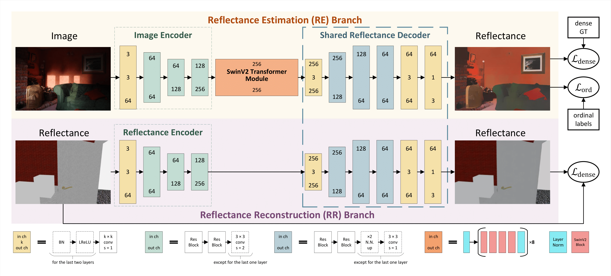

# CRefNet: Learning Consistent Reflectance Estimation With a Decoder-Sharing Transformer
[[paper]](https://purehost.bath.ac.uk/ws/portalfiles/portal/304058985/Jundan_s_TVCG_submission.pdf) 
[[supplement doc]](https://drive.google.com/file/d/13yi0vXYD1Ph5-noZr_Ndx0_SHHtoQrwq/view?usp=sharing)
[[supplement materials]](https://drive.google.com/file/d/1B2oe3c2tYZwYyOwvRHGoyCbNBWGH6lJb/view?usp=drive_link)




Updates
-
+ 05/May/2024: Release the trained models and the evaluation code.


Dependencies
-
+ Python 3.6
+ PyTorch 1.8.2
+ We provide the ```tools/install.txt``` file for other dependencies.


Datasets
-
+ Download:
  + Follow [CGIntrinsics](https://github.com/zhengqili/CGIntrinsics) to download the CGI, IIW and SAW datasets. Z. Li and N. Snavely augment the original [IIW](http://opensurfaces.cs.cornell.edu/intrinsic/#) dataset.
  + MIT-intrinsic: [Webpage](https://people.csail.mit.edu/kimo/publications/intrinsic/).
  + MPI_Sintel: [Webpage](http://sintel.is.tue.mpg.de/depth). Contact the authors to request the version rendered for intrinsic image decomposition.
+ Split files: we back up the used split files in the ```dataset/split_files``` folder. 
MIT-intrinsic's split is coded in ```dataset/mit_intrinsic_dataset.py```.
+ Put the datasets in the ```data/``` folder. The final directory structure:
    ```
    CRefNet project
    |---README.md
    |---...
    |---data
        |---CGIntrinsics
            |---intrinsics_final
                |---images   
                |---rendered
                |---...
            |---IIW
                |---data
                |---test_list
                |---...
            |---SAW
                |---saw_images_512
                |---saw_pixel_labels
                |---saw_splits
                |---train_list
        |---MIT-intrinsic
            |---data
                |---apple
                |---...
        |---MPI_Sintel_IID
            |---MPI-main-albedo
            |---MPI-main-clean
            |---...
    ```
+ Paths to the datasets are set in ```configs/config.py```.


Train
-
[Navigate to the Training Doc](docs/README.md)


Trained Models
-
#### General Use
- **Main Model:** [final_real.pt](https://drive.google.com/file/d/13oVzwJabQt5HmbSWRFbS9AWVc5QtN_2R/view?usp=sharing)
    - **Efficient Variant** [crefnet-e.pt](https://drive.google.com/file/d/143XC2f7skidSmAHJYNNdZDmTw4R6sZKg/view?usp=sharing)

#### Benchmark-Specific Models
- **MIT Benchmark:** [model_MIT.pt](https://drive.google.com/file/d/13sw22gRJU6VFPp773Uy8vVC3PX-UUrv3/view?usp=sharing) 
- **MPI Benchmark:**
[model_MPI_scene_front.pt](https://drive.google.com/file/d/13lIyCS7THXeKXXNj-NSI7wEKDKlzshEi/view?usp=sharing) 
and [model_MPI_scene_reverse.pt](https://drive.google.com/file/d/13relZT9mAfgwLF_rDsJdS5-ggWwmT6Ql/view?usp=sharing)


Evaluation
- 
Download the trained models into the ```./trained_models/``` folder.

### IIW benchmark
We report the WHDR score in the sRGB space in the paper.
+ Evaluate the main model ```final_real.pt```:
  + ```console
    CUDA_VISIBLE_DEVICES="0" python evaluate.py \
        --cfg="configs/crefnet.yaml" \
        MODEL.checkpoint "./trained_models/final_real.pt" \
        TEST.dataset IIW \
        TEST.vis_per_iiw 1 \
        TEST.save_raw_pred True  # set it False if you do not need the float32 raw predictions
    ```
  + We provide the precomputed results in linear RGB space: [png images](https://drive.google.com/file/d/14WUYdcERhNum4dtvxrVCSruWUhxeIK2H/view?usp=sharing) and [float32 predictions](https://drive.google.com/file/d/1DemA6gPa5sPiLPrYMuFZwhUquZDthlFX/view?usp=sharing). 
+ Evaluate the efficient variant ```crefnet-e.pt```:
  + <details>
    <summary>(click to expand)</summary>
    
    ##### 
    ```console
    CUDA_VISIBLE_DEVICES="0" python evaluate.py \
        --cfg="configs/crefnet-e.yaml" \
        MODEL.checkpoint "./trained_models/crefnet-e.pt" \
        TEST.dataset IIW \
        TEST.vis_per_iiw 1 \
        TEST.save_raw_pred True # set it False if you do not need the float32 raw predictions
    ```
    </details>
  + We provide the precomputed results in linear RGB space: [png images](https://drive.google.com/file/d/15LmHI5uAqAApOIhGBkjLmNRcZwHjPuDL/view?usp=sharing) and [float32 predictions](https://drive.google.com/file/d/1DHLpQcO1BhGH50CbUIU5NlxS5oeq2Zvc/view?usp=sharing).


### SAW benchmark
+ Evaluate the main model ```final_real.pt```:
  + ```console
    CUDA_VISIBLE_DEVICES="0" python evaluate.py \
        --cfg="configs/crefnet.yaml" \
        MODEL.checkpoint "./trained_models/final_real.pt" \
        TEST.dataset SAW
    ```  
+ Evaluate the efficient variant ```crefnet-e.pt```:
  + <details>
    <summary>(click to expand)</summary>
    
    ##### 
    ```console
    CUDA_VISIBLE_DEVICES="0" python evaluate.py \
        --cfg="configs/crefnet-e.yaml" \
        MODEL.checkpoint "./trained_models/crefnet-e.pt" \
        TEST.dataset SAW
    ```
    </details>

    
### MIT benchmark
+ Extract the MIT test data: 
  + <details>
    <summary>(click to expand)</summary>
    
    ##### 
    ```console
    python tools/extract_MIT_test_data.py \
        --input_dir "./data/MIT-intrinsic/data" \
        --output_dir "./data/MIT_test_extracted"
    ```
    </details>
+ Infer on the MIT test data:
  + <details>
    <summary>(click to expand)</summary>
    
    ##### 
    ```console
    CUDA_VISIBLE_DEVICES="0" python infer.py \
        --img-dir ./data/MIT_test_extracted \
        --out-dir ./experiments/MIT_test_out \
        --loading_mode "MIT_test" \
        --output_original_size \
        --cfg="configs/crefnet.yaml" \
        MODEL.checkpoint "./trained_models/model_MIT.pt"
    ```
    </details>
  + We provide the precomputed results: [download link](https://drive.google.com/file/d/1DlgvJlZ9YRwvStXEuI0VyfXpYDoq_1I1/view?usp=sharing).
+ Quantitative evaluation: download the evaluation code from the repository [IntrinsicImage](https://github.com/fqnchina/IntrinsicImage/tree/master/evaluation).
Use the MATLAB script ```compute_MIT_error.m``` and modify the corresponding ground truth and prediction paths.

### MPI-Sintel benchmark
+ We adopt the two-fold validation for the MPI benchmark:
  + Evaluate ```model_MPI_scene_front.pt``` on  ```MPI_main_sceneSplit-fullsize-NoDefect-test.txt```:
    + <details>
      <summary>(click to expand)</summary>
    
      ##### 
      ```console
      CUDA_VISIBLE_DEVICES="0" python evaluate.py \
        --cfg="configs/mpi_benchmark/crefnet_S_mpi_scene_front.yaml" \
        DIR "experiments/MPI_out/" \
        MODEL.checkpoint \
        "./trained_models/model_MPI_scene_front.pt" \
        TEST.dense_task "R" \
        TEST.batch_size_cgi 4 \
        TEST.workers_cgi 4 \
        TEST.vis_per_mpi 100 \
        TEST.save_raw_pred True
      ```
      </details>
  + Evaluate ```model_MPI_scene_reverse.pt``` on  ```MPI_main_sceneSplit-fullsize-NoDefect-train.txt```:
    + <details>
      <summary>(click to expand)</summary>
    
      ##### 
      ```console
      CUDA_VISIBLE_DEVICES="0" python evaluate.py \
          --cfg="configs/mpi_benchmark/crefnet_S_mpi_scene_reverse.yaml" \
          DIR "experiments/MPI_out/" \
          MODEL.checkpoint \
          "./trained_models/model_MPI_scene_reverse.pt" \
          TEST.dense_task "R" \
          TEST.batch_size_cgi 4 \
          TEST.workers_cgi 4 \
          TEST.vis_per_mpi 100 \
          TEST.save_raw_pred True
      ```
      </details>    
  + ```TEST.dense_task```: ```"R"```(reflectance) or ```"S"```(shading)
+ Average the printed results of the two folds. 
+ Contact Jundan Luo (<jundanluo22@gmail.com>) if you need the precomputed results on the MPI-Sintel benchmark.


### Model complexity
Coming soon.

[//]: # (++++++++++++++++++++ model complexity should use the training script)

[//]: # (+ Assess the model complexity of CRefNet: ```python model_complexity.py --cfg="configs/crefnet.yaml"```)

[//]: # (  + CRefNet-E: ```python model_complexity.py --cfg="configs/crefnet-e.yaml"```)


Infer
-
+ Infer on images in a single directory:
  ```console
    CUDA_VISIBLE_DEVICES="0" python infer.py \
        --img-dir ./test_examples/ \
        --out-dir ./experiments/out_test_examples/ \
        --min_input_dim 448  \
        --output_original_size \
        --cfg="configs/crefnet.yaml" \
        MODEL.checkpoint "./trained_models/final_real.pt"
    ```
+ ```dataset/imagefolder_dataset.py``` is the dataset class used for loading images in a directory.
+ Other possibly useful arguments:
  + ```--gamma_correct_input```: convert the input images in linear space into sRGB space.
  + ```--gamma_correct_output```: convert the output images in linear space into sRGB space.
  + ```--max_input_dim```: set the maximum dimension of the input images. 
    + If both ```--min_input_dim``` and ```--max_input_dim``` are set, the aspect ratio may not be preserved.
    + If not set either, the original image size will be used.


Acknowledgements
-
- Test images in ```test_examples/``` are from the [IIW benchmark](http://opensurfaces.cs.cornell.edu/intrinsic/). Image license: [Attribution 2.0 Generic](https://creativecommons.org/licenses/by/2.0/).
- Dense metrics (```solver/metrics_intrinsic_images.py```) for the MPI Sintel benchmark were migrated from the MATLAB code provided by the paper [A Simple Model for Intrinsic Image Decomposition with Depth Cues](https://cqf.io/publications.html).
- We have used/modified codes from the following projects:
  + [taming-transformers](https://github.com/CompVis/taming-transformers):
    + Codes for the encoder and decoder architecture we used in ```modeling/vqgan```.
  + [Swin-Transformer](https://github.com/microsoft/Swin-Transformer):
    + The network structure of the SwinV2 transformer layers we used in ```modeling/swin_transformer_v2.py```
  + [CGIntrinsics](https://github.com/zhengqili/CGIntrinsics):
    + Codes for loading data from the CGI and IIW datasets in ```dataset/cgintrinsics_dataset.py``` and ```dataset/iiw_dataset.py```.
    + Codes for evaluation on the IIW benchmark in ```solver/metrics_iiw.py```. 
    This code is originally provided by [IIW](http://opensurfaces.cs.cornell.edu/intrinsic/#).
    + Codes for evaluation on the SAW benchmark in ```solver/metrics_saw.py``` and ```solver/saw_utils.py```.
    These codes are originally provided by [SAW](http://opensurfaces.cs.cornell.edu/saw/).
    

Citation
-
If you find this code useful for your research, please cite:
  ```
    @article{luo2023crefnet,
      title={CRefNet: Learning Consistent Reflectance Estimation With a Decoder-Sharing Transformer},
      author={Luo, Jundan and Zhao, Nanxuan and Li, Wenbin and Richardt, Christian},
      journal={IEEE Transactions on Visualization and Computer Graphics},
      year={2023},
      publisher={IEEE}
    }
  ```

Contact
-
Please contact Jundan Luo (<jundanluo22@gmail.com>) if you have any questions. 
Feel free to give any feedback.
